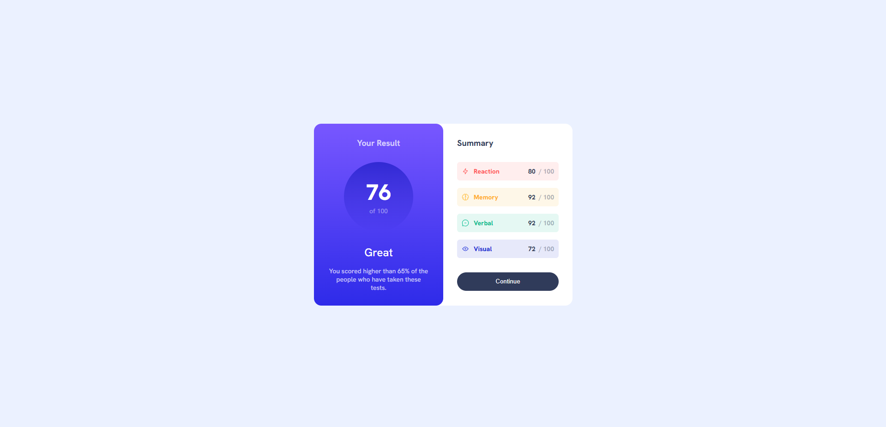
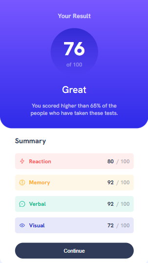

# Frontend Mentor - Results summary component solution

This is a solution to the [Results summary component challenge on Frontend Mentor](https://www.frontendmentor.io/challenges/results-summary-component-CE_K6s0maV). Frontend Mentor challenges help you improve your coding skills by building realistic projects. 

## Overview

### The challenge

Users should be able to:

- View the optimal layout for the interface depending on their device's screen size
- See hover and focus states for all interactive elements on the page

### Screenshot

### Links

- Solution URL: [Solution Repository](https://github.com/lucas-r-moura/results-summary-frontend-mentor)
- Live Site URL: [Live Solution](https://lucas-r-moura.github.io/results-summary-frontend-mentor/)

## My process

### Built with

- Semantic HTML5 markup
- CSS custom properties
- Flexbox

## Author

- Frontend Mentor - [@lucas-r-moura](https://www.frontendmentor.io/profile/lucas-r-moura)
- Linkedin - [Lucas Moura](https://www.linkedin.com/in/lucas-r-moura/)
